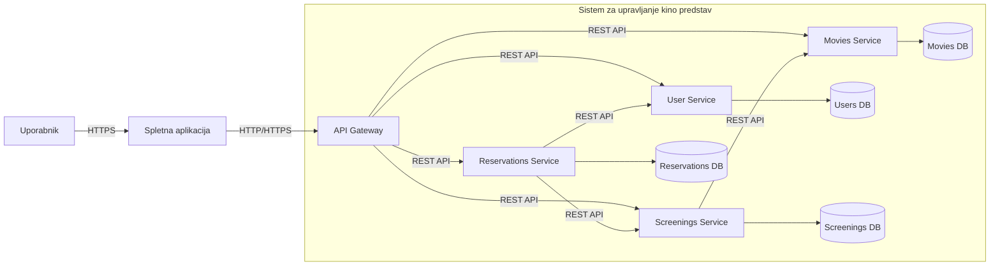
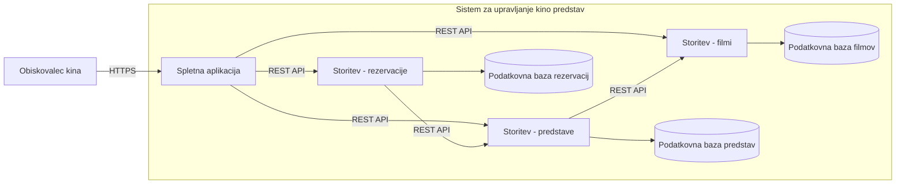

# Cinema Microservices

## Opis sistema

Cinema Microservices je mikrostoritveni sistem za upravljanje kino predstav in rezervacij sedežev. Sistem omogoča pregled filmov, ogled terminov predvajanj ter rezervacijo sedežev za izbrane predstave preko spletne aplikacije.

Sistem je zasnovan po principih mikrostoritvene arhitekture, kjer so posamezne funkcionalnosti razdeljene na ločene storitve. Vsaka storitev je odgovorna za svojo domeno in komunicira z ostalimi storitvami preko jasno definiranih API-jev.

Cilj sistema je prikazati uporabo mikrostoritvene arhitekture, načel čiste arhitekture (Clean Architecture) ter pregledno strukturo repozitorija.

---

## Poslovni problem

Kinematografi morajo učinkovito upravljati katalog filmov, razpored predvajanj in rezervacije sedežev. Brez ustreznega sistema je upravljanje teh podatkov nepregledno in lahko povzroča težave pri organizaciji predstav ter rezervacijah.

Ta sistem omogoča:

- upravljanje kataloga filmov
- upravljanje terminov predvajanj
- rezervacijo sedežev za posamezne predstave
- pregled informacij preko spletnega uporabniškega vmesnika

Sistem je razdeljen na več mikrostoritev, ki so odgovorne za posamezne poslovne domene.

---

## Arhitektura sistema

Sistem je sestavljen iz treh mikrostoritev in ene spletne aplikacije.

Mikrostoritve so med seboj ohlapno povezane in komunicirajo preko REST API vmesnikov. Vsaka mikrostoritev upravlja svojo domeno in podatke, kar omogoča večjo modularnost in lažje vzdrževanje sistema.

Glavne komponente sistema so:

- Movies Service
- Screenings Service# Cinema Microservices

## Opis sistema

Cinema Microservices je mikrostoritveni sistem za upravljanje kino predstav, uporabnikov in rezervacij sedežev. Sistem omogoča pregled filmov, upravljanje terminov predvajanj, registracijo oziroma evidenco uporabnikov ter rezervacijo sedežev za izbrane predstave preko spletne aplikacije.

Sistem je zasnovan po principih mikrostoritvene arhitekture, kjer so posamezne funkcionalnosti razdeljene na ločene storitve. Vsaka storitev je odgovorna za svojo domeno in komunicira z ostalimi storitvami preko jasno definiranih API-jev.

Cilj sistema je prikazati uporabo mikrostoritvene arhitekture, načel čiste arhitekture (Clean Architecture) ter pregledno strukturo repozitorija.

---

## Poslovni problem

Kinematografi morajo učinkovito upravljati katalog filmov, razpored predvajanj, uporabniške podatke in rezervacije sedežev. Brez ustreznega sistema je upravljanje teh podatkov nepregledno in lahko povzroča težave pri organizaciji predstav, vodenju uporabnikov in rezervacijah.

Ta sistem omogoča:

- upravljanje kataloga filmov
- upravljanje terminov predvajanj
- upravljanje uporabnikov
- rezervacijo sedežev za posamezne predstave
- pregled informacij preko spletnega uporabniškega vmesnika

Sistem je razdeljen na več mikrostoritev, ki so odgovorne za posamezne poslovne domene.

---

## Arhitektura sistema

Sistem je sestavljen iz štirih mikrostoritev, API Gateway komponente in ene spletne aplikacije.

Glavne komponente sistema so:

- API Gateway
- User Service
- Movies Service
- Screenings Service
- Reservations Service
- Web Application

Spletna aplikacija deluje kot uporabniški vmesnik, ki komunicira z API Gateway komponento. API Gateway predstavlja enotno vstopno točko v sistem in usmerja zahteve do ustreznih mikrostoritev.

Vsaka mikrostoritev upravlja svojo domeno in podatke, kar omogoča večjo modularnost, ohlapno sklopljenost in lažje vzdrževanje sistema.

---

## Mikrostoritve

### API Gateway

API Gateway predstavlja enotno vstopno točko za dostop do mikrostoritev.

Njegove odgovornosti so:
- sprejem zahtev iz spletne aplikacije
- usmerjanje zahtev do ustreznih storitev
- poenoten dostop do sistema

---

### User Service

User Service je odgovoren za upravljanje uporabnikov sistema.

Funkcionalnosti:
- ustvarjanje uporabnikov
- pregled uporabniških podatkov
- pridobivanje podatkov o posameznem uporabniku

Primer podatkov:
- ime
- priimek
- elektronski naslov

---

### Movies Service

Movies Service je odgovoren za upravljanje podatkov o filmih.

Funkcionalnosti:
- dodajanje filmov
- pregled kataloga filmov
- pridobivanje informacij o posameznem filmu

Primer podatkov:
- naslov
- opis
- žanr
- trajanje

---

### Screenings Service

Screenings Service je odgovoren za upravljanje terminov predvajanj filmov v kinu.

Funkcionalnosti:
- ustvarjanje terminov predvajanja
- pregled razporeda predstav
- povezava med filmom in terminom predvajanja

Primer podatkov:
- film
- datum in čas
- dvorana
- število sedežev

---

### Reservations Service

Reservations Service je odgovoren za upravljanje rezervacij sedežev za posamezne predstave.

Funkcionalnosti:
- ustvarjanje rezervacije
- pregled rezervacij
- preverjanje razpoložljivosti sedežev

Primer podatkov:
- uporabnik
- termin predstave
- sedež
- status rezervacije

---

### Web Application

Spletna aplikacija predstavlja uporabniški vmesnik sistema.

Uporabnikom omogoča:
- pregled filmov
- ogled terminov predstav
- prijavo oziroma pregled uporabniških podatkov
- rezervacijo sedežev

Spletna aplikacija komunicira z API Gateway komponento preko HTTP/HTTPS zahtev.

---

## Komunikacija med storitvami

Komunikacija v sistemu poteka preko REST API.

Primer poteka:

1. Uporabnik dostopa do spletne aplikacije.
2. Spletna aplikacija pošlje zahtevo na API Gateway.
3. API Gateway zahtevo usmeri do ustrezne mikrostoritve.
4. Movies Service vrne seznam filmov.
5. Screenings Service vrne termine za izbran film.
6. User Service vrne podatke o uporabniku.
7. Reservations Service ustvari rezervacijo za izbrani termin.

---

## Diagram arhitekture



---

## Struktura repozitorija

Repozitorij je organiziran po principu "screaming architecture", kjer imena map predstavljajo poslovne koncepte sistema.

```text
cinema-microservices/
│
├── api-gateway/      # enotna vstopna točka v sistem
├── user-service/     # mikrostoritev za upravljanje uporabnikov
├── movies/           # mikrostoritev za upravljanje filmov
├── screenings/       # mikrostoritev za termine predvajanj
├── reservations/     # mikrostoritev za rezervacije sedežev
├── web-app/          # spletni uporabniški vmesnik
│
├── docs/             # dodatna dokumentacija
└── README.md         # opis sistema in arhitekture
```

Vsaka mikrostoritev vsebuje svojo poslovno logiko, API sloj in infrastrukturo.

---

## Arhitekturna načela

Pri razvoju sistema sledimo načelom čiste arhitekture (Clean Architecture):

- poslovna logika je ločena od infrastrukture
- mikrostoritve so neodvisne
- komunikacija poteka preko jasno definiranih API-jev
- odvisnosti tečejo od zunanjih slojev proti domeni
- struktura repozitorija jasno odraža poslovne koncepte sistema
- Reservations Service
- Web Application

Spletna aplikacija deluje kot uporabniški vmesnik, ki komunicira z mikrostoritvami in prikazuje podatke uporabniku.

---

## Mikrostoritve

### Movies Service

Odgovorna za upravljanje podatkov o filmih.

Funkcionalnosti:
- dodajanje filmov
- pregled kataloga filmov
- pridobivanje informacij o posameznem filmu

Primer podatkov:
- naslov
- opis
- žanr
- trajanje

---

### Screenings Service

Odgovorna za upravljanje terminov predvajanj filmov v kinu.

Funkcionalnosti:
- ustvarjanje terminov predvajanja
- pregled razporeda predstav
- povezava med filmom in terminom predvajanja

Primer podatkov:
- film
- datum in čas
- dvorana
- število sedežev

---

### Reservations Service

Odgovorna za upravljanje rezervacij sedežev za posamezne predstave.

Funkcionalnosti:
- ustvarjanje rezervacije
- pregled rezervacij
- preverjanje razpoložljivosti sedežev

Primer podatkov:
- film
- termin predstave
- sedež
- ime uporabnika

---

### Web Application

Spletna aplikacija predstavlja uporabniški vmesnik sistema.

Uporabnikom omogoča:
- pregled filmov
- ogled terminov predstav
- rezervacijo sedežev

Spletna aplikacija komunicira z mikrostoritvami preko REST API.

---

## Komunikacija med storitvami

Mikrostoritve komunicirajo preko REST API vmesnikov.

Primer poteka:

1. Spletna aplikacija pridobi seznam filmov iz **Movies Service**.
2. Uporabnik izbere film in aplikacija pridobi termine iz **Screenings Service**.
3. Uporabnik izbere termin in rezervira sedež.
4. Zahteva se pošlje v **Reservations Service**, kjer se ustvari rezervacija.

---

## Struktura repozitorija

```
cinema-microservices/
│
├── movies/          # mikrostoritev za upravljanje filmov
├── screenings/      # mikrostoritev za termine predvajanj
├── reservations/    # mikrostoritev za rezervacije sedežev
├── web-app/         # spletni uporabniški vmesnik
│
├── docs/            # dodatna dokumentacija
└── README.md        # opis sistema in arhitekture
```

## Arhitekturna načela

Pri razvoju sistema sledimo načelom čiste arhitekture (Clean Architecture):

- poslovna logika je ločena od infrastrukture
- mikrostoritve so neodvisne
- komunikacija poteka preko jasno definiranih API-jev
- odvisnosti tečejo od zunanjih slojev proti domeni


## Diagram arhitekture


