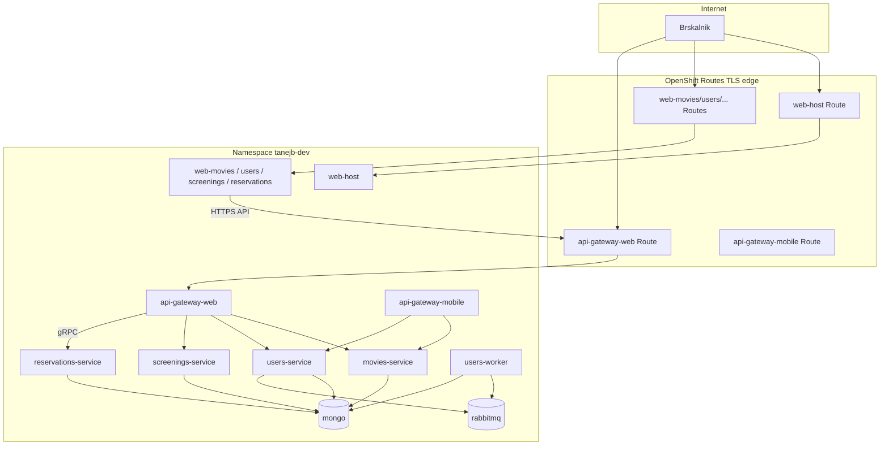

# Cinema Microservices — namestitev na OpenShift (oddaja)

Dokument opisuje namestitev sistema na **Red Hat OpenShift Developer Sandbox** (projekt `tanejb-dev`, cluster `apps.rm3.7wse.p1.openshiftapps.com`).

Operativna navodila po korakih: [openshift/README.md](../openshift/README.md).

---

## 1. Arhitektura v clusterju



| Komponenta | Kubernetes objekt | Port | Javni Route |
|------------|-------------------|------|-------------|
| MongoDB | `deployment/mongo`, `svc/mongo` | 27017 | ne |
| RabbitMQ | `deployment/rabbitmq` | 5672, 15672 | ne |
| Movies MS | `deployment/movies-service` | 3001 | ne |
| Users MS | `deployment/users-service` | 3002 | ne |
| Screenings MS | `deployment/screenings-service` | 3003 | ne |
| Reservations MS | `deployment/reservations-service` | 50051 gRPC | ne |
| Users worker | `deployment/users-worker` | — | ne |
| API Gateway Web | `deployment/api-gateway-web` | 8080 | `api-gateway-web-tanejb-dev...` |
| API Gateway Mobile | `deployment/api-gateway-mobile` | 8081 | `api-gateway-mobile-tanejb-dev...` |
| Web host + MFE | `deployment/web-*` | 4310–4314 | `web-host-tanejb-dev...` itd. |

---

## 2. Varnost

### ConfigMap in Secret

- **`cinema-common`** (ConfigMap): neskrivni URI-ji, imena baz, RabbitMQ host (brez gesla).
- **`cinema-secrets`** (Secret): `RABBITMQ_USER`, `RABBITMQ_PASSWORD`.

Gesla niso v Git repozitoriju v plain text (Secret YAML je primer za sandbox).

### NetworkPolicy

Datoteka `openshift/policies/network-policies.yaml` omejuje:

| Cilj | Dovoljen ingress od |
|------|---------------------|
| `mongo` | movies, users, screenings, reservations, users-worker |
| `rabbitmq` | users-service, users-worker |
| movies / users / screenings | api-gateway-web, api-gateway-mobile |
| reservations | gatewayi (port 50051) |
| api-gateway-* | vsi (Route) |
| web-* | vsi (Route) |

**Opomba:** Na Developer Sandboxu je NetworkPolicy odvisna od SDN; če politike niso aktivne, promet ostane privzeto odprt znotraj namespace-a.

### Gateway vzorca (izven OpenShift manifestov)

- **Correlation ID** (`X-Request-Id`) — web in mobile gateway.
- **Circuit breaker** — zaščita pred preobremenitvijo downstream storitev.

---

## 3. Skaliranje (HPA)

`openshift/scaling/movies-hpa.yaml`:

- **Deployment:** `movies-service`
- **minReplicas:** 1, **maxReplicas:** 3
- **Metrika:** CPU 70 %

Preverjanje:

```bash
oc get hpa movies-service-hpa
oc describe hpa movies-service-hpa
```

Če metrike niso na voljo (`<unknown>/70%`), v sandboxu pogosto manjka ali je omejen metrics-server — HPA je vseeno konfiguriran kot zahteva naloge.

---

## 4. Slike in tagi

| Vir | Opis |
|-----|------|
| DockerHub | `tanej666/cinema-*` |
| CI | `latest` + `sha-<commit>` ob push na `main` |
| Lokalni frontend build | `build-frontend.ps1` → tag `openshift-YYYYMMDD-HHmm` + `latest` |

Pin tagov v clusterju (Kustomize):

```bash
# po build-frontend.ps1
./openshift/scripts/set-image-tag.sh
# ali
.\openshift\scripts\set-image-tag.ps1
oc apply -k openshift/
```

GitHub Actions (frontend): nastavi **Repository variables** `VITE_API_GATEWAY_WEB`, `VITE_REMOTE_*` na Route URL-je, da CI ne objavi slik z `localhost`.

---

## 5. Preverjanje delovanja

### Infrastruktura in podi

```bash
oc project tanejb-dev
oc get pods
oc get routes
oc get hpa
oc get networkpolicy
```

### Health gateway

```bash
curl -k "https://$(oc get route api-gateway-web -o jsonpath='{.spec.host}')/health"
```

### Web UI

`https://web-host-tanejb-dev.apps.rm3.7wse.p1.openshiftapps.com/`

V MFE mora `Gateway:` kazati `https://api-gateway-web-...`, ne `localhost`.

### Podatki v MongoDB

```bash
oc exec deployment/mongo -- mongosh users_db --quiet --eval 'db.users.find().pretty()'
```

---

## 6. Znane omejitve (sandbox)

| Omejitev | Posledica |
|----------|-----------|
| Kvota `replicasets.apps` (30) | Po več `rollout restart` je treba brisati RS z 0 replikami |
| DockerHub rate limit | Paralelni CI buildi lahko padnejo (workflow `max-parallel: 3`) |
| `:latest` cache | Za frontend uporabi fiksni tag + `set-image-tag` |
| Vite preview v kontejnerju | `web-frontend.yaml` uporablja `/tmp/vite.config.js` workaround |
| HPA metrike | Lahko niso popolne na sandboxu |

---

## 7. Povzetek korakov naloge

| Korak | Vsebina | Status |
|-------|---------|--------|
| 0 | Prijava, projekt `tanejb-dev` | |
| 1 | Mongo + RabbitMQ, Secret/ConfigMap | |
| 2 | Mikrostoritve + worker | |
| 3 | Gateway + Routes | |
| 4 | Web UI (MFE, build z Route URL) | |
| 5 | HPA, NetworkPolicy, dokumentacija | |

Manifesti: `oc apply -k openshift/`.
